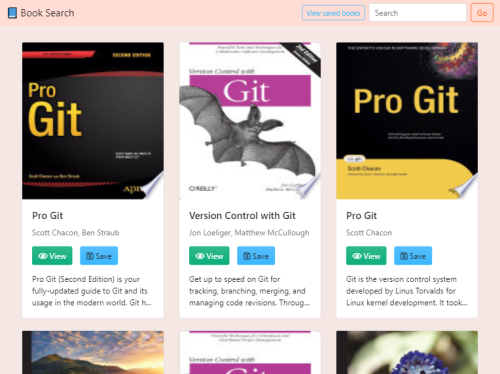

# Google Books Search
A React.js app for searching the Google Books API and saving individual books to a database.  

## Table of Contents
- [Usage](#Usage)
- [Features](#Features)
- [Contributors](#Contributors)
- [Dependencies](#Dependencies)
## Usage
### [Try it!](https://sleepy-dawn-46114.herokuapp.com/)
Type a query in the search bar and press enter or click the "Go" button to find books.  
To save a book, click the "Save" button on the book card.  
Click "View saved books" in the header to see all saved books and delete individual books from the database.
## Features
- Single-page app with React
- Books saved via api calls to external db

## Contributors
<a href="https://github.com/mgrinx">mgrinx</a>   

## Dependencies

